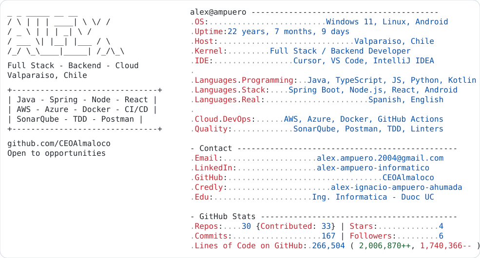

<a href="https://github.com/CEOAlmaloco">
  <picture>
    <source media="(prefers-color-scheme: dark)" srcset="./dark_mode.svg">
    
  </picture>
</a>

  

<h3><code>alex@github ~ $ ./contributions.sh</code></h3>

  

<h3><code>alex@github ~ $ whoami</code></h3>

---

### About Me

I’m a curious and persistent person with a strong desire to learn. I enjoy understanding how things work behind the scenes and turning ideas into real, working solutions. I like building projects where I can improve, make mistakes, and iterate until things feel right.

I’m interested in software development, doing things properly, and growing both technically and personally. I value collaboration, continuous learning, and sharing knowledge with others.

This profile is a place to showcase what I’m building along the way.

---

### Socials

---

### Tech Stack

---

### GitHub Stats

  
  

  
  

